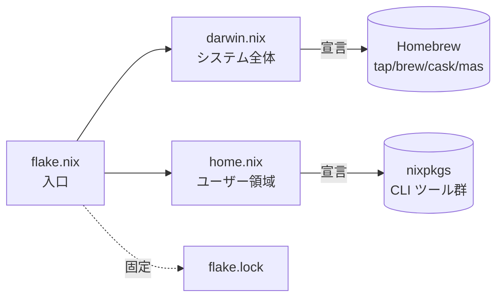

# nix-darwin 運用マニュアル

このリポジトリ (`castle`) における **nix-darwin + Home Manager + 宣言 Homebrew** の
運用手順をまとめたドキュメント。日々の操作・トラブル対応・設計意図の参照用。

> [!NOTE]
> 構成ファイルの実体は `castle/config/nix-darwin/` に存在し、homeshick の
> `home/.config -> ../config` symlink により `~/.config/nix-darwin/` から参照される。

---

## 1. 全体像



| ファイル | 役割 | 何を書く |
| --- | --- | --- |
| `flake.nix` | エントリポイント | inputs（nixpkgs / nix-darwin / home-manager）と `darwinConfigurations` |
| `darwin.nix` | システム全体（root 権限） | `/etc/*`, launchd, Homebrew 宣言, `system.primaryUser` |
| `home.nix` | ユーザー領域 (`~/`) | CLI ツール（`home.packages`）, 個人 launchd agent |
| `flake.lock` | inputs 固定 | 自動生成・コミット対象 |

### 設計方針

- **CLI = Nix / GUI = Homebrew** で住み分け。
- `programs.<tool>` 系の Home Manager モジュールは **意図的に有効化しない**。
  zsh / git / nvim 等の設定は homeshick 配下を唯一のソース・オブ・トゥルースとし、
  `~/.config/*` の二重管理を避ける。
- Homebrew は `homebrew.onActivation.cleanup = "none"` で安全側起動。
  未宣言パッケージを自動削除する `"zap"` への切り替えは、移管が安定してから検討。

---

## 2. 日常運用コマンド

### 2.1 設定変更を反映する

```bash
sudo darwin-rebuild switch --flake ~/.config/nix-darwin
```

- **sudo 必須**。最近の nix-darwin は activation を root 化した。
- 所要時間: 軽微な変更なら 30 秒〜1 分。新規パッケージのビルド/取得が走ると数分。
- 完了時に `Activating ...` 系のログが流れて、最後にプロンプトに戻る。

### 2.2 inputs を更新する

```bash
nix flake update --flake ~/.config/nix-darwin
sudo darwin-rebuild switch --flake ~/.config/nix-darwin
```

- `nix flake update` は `flake.lock` を最新の nixpkgs / nix-darwin / home-manager に書き換える。
- そのまま switch すれば反映。問題があれば `git checkout flake.lock` で巻き戻せる。

### 2.3 評価のみ（適用なし）

```bash
nix flake check ~/.config/nix-darwin
```

- 構文エラー・型エラーを早期検出。実環境に変更を加えない。
- 編集中に走らせて素早くフィードバックを得る用。

### 2.4 状態確認

```bash
darwin-rebuild --list-generations           # これまでの世代一覧
sudo darwin-rebuild rollback                # 直前の世代に戻す
nix-env --list-generations -p /nix/var/nix/profiles/system   # 同上 (詳細版)
```

- generation は世代管理。環境を壊しても直前に戻せるのが Nix の強み。

---

## 3. パッケージ管理

### 3.1 CLI ツールを追加する（Nix）

> [!IMPORTANT]
> 追加する前に nixpkgs での提供有無を確認する:
> ```bash
> nix --extra-experimental-features 'nix-command flakes' eval --raw \
>   "github:NixOS/nixpkgs/nixpkgs-unstable#<name>.pname"
> ```
> 未収載のツール（例: `xcode-build-server`）は brew のままにする。

`home.nix` の `home.packages` に追加して switch:

```nix
home.packages = with pkgs; [
  ...既存...
  ripgrep
  fd
  bat
];
```

```bash
sudo darwin-rebuild switch --flake ~/.config/nix-darwin
which <tool>   # /etc/profiles/per-user/$USER/bin/<tool> を返せば OK
```

### 3.2 GUI アプリを追加する（Homebrew Cask）

`darwin.nix` の `homebrew.casks` に追加:

```nix
casks = [
  ...既存...
  "iterm2"
  "discord"
];
```

switch すると `brew install --cask <name>` が自動実行される。

### 3.3 サードパーティ tap を使う

```nix
taps = [
  "homebrew/services"
  "anomalyco/tap"        # 例: anomalyco/tap/opencode を入れる場合
];

brews = [
  "anomalyco/tap/opencode"
];
```

- `<owner>/<tap>/<formula>` 形式で書けば自動で tap 解決される。
- 明示的に `taps` に書いた方が依存関係が読みやすい（推奨）。

### 3.4 Mac App Store アプリを追加する（mas）

```bash
brew install mas              # 初回のみ
mas list                      # アプリ ID を取得
```

```nix
masApps = {
  "Xcode" = 497799835;
  "Magnet" = 441258766;
};
```

---

## 4. brew → Nix 移管手順

CLI ツールを Homebrew から Nix 管理へ移したい場合の安全手順。

### 4.1 標準フロー

1. **Nix 側に追加**（`home.nix` の `home.packages` に書く）
2. **switch して Nix 版が PATH に乗ることを確認**
   ```bash
   sudo darwin-rebuild switch --flake ~/.config/nix-darwin
   exec "$SHELL" -l    # 新シェルで PATH を読み直し
   which <tool>   # /etc/profiles/per-user/.../bin/<tool> を期待
   ```
3. **brew 側を削除**（`darwin.nix` の `brews` からコメントアウト）
4. もう一度 switch（宣言を反映）
5. **brew バイナリの実体を掃除**
   ```bash
   brew uninstall <tool>
   which <tool>   # まだ Nix 版が見えれば成功
   ```

### 4.2 リスク別の移管推奨順

| リスク | 対象 | 注意点 |
| --- | --- | --- |
| 低 | `tree`, `watch`, `jq`, `ripgrep`, `fd`, `bat`, `eza`, `tig` | 単発 CLI、設定なし。安全 |
| 中 | `gh`, `ghq`, `zoxide`, `starship` | シェル統合あり。動作確認しっかり |
| 対処済み | `direnv`, `fzf` | macOS で checkPhase ハングリスクあり → `doCheck=false` で回避（実例あり） |
| 高 | `neovim`, `tmux` | プラグイン管理が効く。設定の互換性確認 |
| 高 | `node`, `go` | anyenv と競合する可能性。最後に検討 |
| nixpkgs 未収載 | `xcode-build-server` 等 | nixpkgs に存在しないツールは brew のまま運用 |

### 4.3 checkPhase ハング回避

direnv のように Nix のテストが macOS で固まる場合の選択肢:

- **A**: brew のままにする（合理的）
- **B**: `home.packages` で `overrideAttrs` を使ってテスト無効化（**実績あり**）

```nix
home.packages = with pkgs; [
  ...
  (direnv.overrideAttrs (_: { doCheck = false; }))
  (fzf.overrideAttrs (_: { doCheck = false; }))
];
```

`fzf` のように **実際には今ハングしないが過去に実績がある** ツールは、保険として
`doCheck = false` を残すか、標準ビルドに戻すか運用判断する。安定が確認できたら
override を外して標準ビルドに戻す方が望ましい。

### 4.4 シェル hook を持つツール移管時の追加手順

`direnv` / `zoxide` / `starship` 等は **シェル起動時に `eval "$(<tool> hook zsh)"` で
hook 関数を生成し、その中に当該バイナリのフルパスが焼き込まれる**。
brew → Nix 移管時の流れ:

1. Nix 版インストール（switch）
2. `brew uninstall <tool>` で旧バイナリを物理削除
3. `exec "$SHELL" -l` で新シェル起動 → hook 関数が Nix 版のパスで再生成される
4. `<tool> hook zsh | head -5` で `/nix/store/.../bin/<tool>` が埋め込まれていることを確認

`brew uninstall` を飛ばすと「hook が brew パスを参照したまま、実体は消えている」状態
になり、`_direnv_hook:2: no such file or directory: ...` エラーが出続ける。

---

## 5. 既知の落とし穴

### 5.1 PATH 順序: Homebrew が Nix を上書きする

macOS の `/etc/zprofile` が `path_helper` を呼び、`/etc/paths.d/Homebrew` を読んで
`/opt/homebrew/bin` を **PATH 先頭に再挿入** する。これが nix-darwin の `/etc/zshrc` より
**後**に効くため、放置すると brew 版が常に勝つ。

**対処**: `home/.zshrc` 冒頭で Nix プロファイルを強制 prepend:

```bash
for _nix_dir in \
  "/etc/profiles/per-user/$USER/bin" \
  /run/current-system/sw/bin \
  /nix/var/nix/profiles/default/bin; do
  [[ -d "$_nix_dir" ]] && PATH="$_nix_dir:${PATH//$_nix_dir:/}"
done
unset _nix_dir
export PATH
```

### 5.2 sudo パスワードと TTY

`sudo darwin-rebuild` は対話入力を要求するので、Claude Code のような非 TTY 環境からは
直接実行できない。**必ず手元のターミナル**で叩く。

### 5.3 `system.primaryUser` の必須化

最近の nix-darwin は activation を root 化した影響で、`homebrew.enable` などの
ユーザー紐付けオプションは `system.primaryUser` 明示が必須。未設定だと:

```
error: Failed assertions: ... `homebrew.enable` ...
       you have been using to run `darwin-rebuild`.
```

→ `darwin.nix` に `system.primaryUser = "<username>";` を追加する。

### 5.4 deprecated `homebrew.global.lockfiles`

Homebrew 4.4.0 (2024-10) で lockfile 機能が削除されたため、
`homebrew.global.lockfiles` / `noLock` は no-op。設定から削除すべし（warning が出る）。

### 5.5 `/Users/...` not owned by you の警告

```
warning: $HOME ('/Users/...') is not owned by you, falling back to /var/root
```

`sudo` 配下で `$HOME` が継承されているための無害警告。動作に影響なし。
気になる場合は `sudo -H darwin-rebuild ...` を使う。

### 5.6 ロールバック

何か壊れたら:

```bash
sudo darwin-rebuild rollback
```

または特定の世代に戻す:

```bash
darwin-rebuild --list-generations
sudo darwin-rebuild switch --switch-generation <番号>
```

---

## 6. ファイル別の編集の流れ

### 6.1 「全マシン共通の追加」をしたい場合

→ `darwin.nix` または `home.nix` を直接編集 → switch → `/castle` で push。

### 6.2 「このマシンでだけ動かしたい」場合

マルチホスト構成への移行手順は **§7.2** を参照。
共通設定だけで済む段階では `flake.nix` にホストエントリを足すだけで OK。

---

## 7. 別マシンへの展開

### 7.1 単純複製（同じセットアップでよい場合）

```bash
# ターゲットマシンで
git clone git@github.com:branch10480/castle.git ~/.homesick/repos/castle
homeshick link castle

# Nix インストール
curl --proto '=https' --tlsv1.2 -sSf -L https://install.determinate.systems/nix | sh -s -- install

# 適用
~/.homesick/repos/castle/scripts/bootstrap-nix-darwin.sh
```

### 7.2 仕事マシンを別ホストとして追加する手順

例: 仕事用マシン `WorkMBA` を追加し、private 機 (`ToshiharunoMacBook-Pro`) と差分管理する。

#### Step 1. ターゲットマシンの hostname を確認

```bash
# 仕事マシン側で
scutil --get LocalHostName   # 例: WorkMBA
hostname -s
```

`flake.nix` の `darwinConfigurations` のキーはこの hostname と一致させる。

#### Step 2. `flake.nix` にホストエントリを追加

```nix
darwinConfigurations = {
  "ToshiharunoMacBook-Pro" = mkDarwin "ToshiharunoMacBook-Pro";
  "WorkMBA"                = mkDarwin "WorkMBA";    # ← 追加
  default                  = mkDarwin "ToshiharunoMacBook-Pro";
};
```

これだけで両機共通の `darwin.nix` / `home.nix` が当たるようになる。

#### Step 3. ホスト別の差分が必要な場合だけディレクトリ分割

共通設定で済むなら Step 2 で終了。仕事用にだけ入れたいパッケージや、
private にしか入れたくないものが出てきた段階で構造を分ける:

```
config/nix-darwin/
├── flake.nix
├── modules/
│   ├── common-darwin.nix      # 既存 darwin.nix の共通部分
│   └── common-home.nix        # 既存 home.nix の共通部分
└── hosts/
    ├── private/
    │   ├── darwin.nix         # private 専用 (例: hammerspoon, vlc)
    │   └── home.nix
    └── work/
        ├── darwin.nix         # 仕事専用 (例: 社内ツール、Slack)
        └── home.nix
```

`flake.nix` の `mkDarwin` を以下のように改造:

```nix
mkDarwin = hostname: hostDir:
  nix-darwin.lib.darwinSystem {
    inherit system;
    specialArgs = { inherit username hostname; };
    modules = [
      ./modules/common-darwin.nix
      (./hosts + "/${hostDir}/darwin.nix")
      home-manager.darwinModules.home-manager
      {
        home-manager.useGlobalPkgs = true;
        home-manager.useUserPackages = true;
        home-manager.extraSpecialArgs = { inherit username; };
        home-manager.users.${username} = import (./hosts + "/${hostDir}/home.nix");
        networking.hostName = hostname;
        networking.computerName = hostname;
      }
    ];
  };

darwinConfigurations = {
  "ToshiharunoMacBook-Pro" = mkDarwin "ToshiharunoMacBook-Pro" "private";
  "WorkMBA"                = mkDarwin "WorkMBA" "work";
};
```

各 `hosts/<name>/darwin.nix` は `imports = [ ../../modules/common-darwin.nix ];`
で共通部分を取り込み、上書きしたいキーだけ書く。

#### Step 4. ユーザー名が違う場合

`flake.nix` の `username` をホスト別に分岐:

```nix
mkDarwin = hostname: hostDir: username:
  nix-darwin.lib.darwinSystem {
    specialArgs = { inherit username hostname; };
    # ...
  };

darwinConfigurations = {
  "ToshiharunoMacBook-Pro" = mkDarwin "ToshiharunoMacBook-Pro" "private" "toshiharuimaeda";
  "WorkMBA"                = mkDarwin "WorkMBA"                "work"    "t-imaeda";
};
```

`darwin.nix` 側の `system.primaryUser = username;` と `users.users.${username}` は
`specialArgs` 経由で受け取っているのでそのまま動く。

#### Step 5. 仕事マシン側で初回適用

```bash
# 1) dotfiles を入れる
brew install homeshick   # まだ無ければ
homeshick clone branch10480/castle
homeshick link castle

# 2) Nix を入れる
curl --proto '=https' --tlsv1.2 -sSf -L https://install.determinate.systems/nix | sh -s -- install
exec "$SHELL" -l

# 3) 初回 switch（hostname が flake のキーと一致していれば --flake . でOK）
sudo darwin-rebuild switch --flake ~/.config/nix-darwin#WorkMBA
```

以後は `darwin-rebuild switch --flake ~/.config/nix-darwin` で日常運用可。

#### Step 6. 機密差分の扱い

仕事専用の社内 tap・private registry など **公開リポジトリにコミットしたくない**
設定が出たら、`hosts/work/local.nix` を `.gitignore` に入れて参照する:

```nix
# hosts/work/darwin.nix
imports = [
  ../../modules/common-darwin.nix
  ./local.nix   # gitignored
];
```

または `~/.zshrc.local` と同様に、castle 外のディレクトリに置いて
`builtins.readFile` 等で取り込む方式も可。

---

## 8. クリーンアップ運用（cleanup モード）

`darwin.nix` の `homebrew.onActivation.cleanup` で挙動を選択:

| 値 | 挙動 | 用途 |
| --- | --- | --- |
| `"none"` | 宣言外の brew/cask に触らない | **現在の値**。安全運用、検証期間中 |
| `"uninstall"` | 宣言外を `brew uninstall` する | バイナリは消すが、tap や設定は残す |
| `"zap"` | `brew uninstall --zap` 相当（設定ファイルも削除） | 完全宣言管理。理想形だが破壊的 |

**`"zap"` への切り替え条件**:
- すべての brew/cask が宣言と一致していること
- 試験的に `brew install` した一時パッケージが残っていないこと
- 普段から「宣言ファースト」で運用する習慣がついていること

---

## 9. トラブルシューティング早見表

| 症状 | 原因 | 対処 |
| --- | --- | --- |
| `which <tool>` が brew 版を返す | PATH 順序 | `exec "$SHELL" -l` で再読込。それでもなら §5.1 |
| `system activation must now be run as root` | sudo 忘れ | `sudo darwin-rebuild switch ...` |
| `homebrew.enable ... primaryUser` エラー | `system.primaryUser` 未設定 | §5.3 |
| `nix flake check` で `not tracked by Git` | flake は git tracked ファイルしか見ない | `git add -N <file>` で intent-to-add |
| direnv ビルドが固まる | checkPhase ハング | §4.3 の `doCheck=false` で回避 |
| `_direnv_hook:2: no such file or directory: ...` | hook が古い brew パスを参照 | §4.4: `brew uninstall <tool>` → `exec "$SHELL" -l` |
| switch が途中で止まる | `Sorry, try again.` 後の再入力 / ネットワーク | `Ctrl+C` 後に再実行 |
| 環境を壊した | activation 失敗 | `sudo darwin-rebuild rollback` |

---

## 10. 参照リンク

- [nix-darwin (LnL7/nix-darwin)](https://github.com/LnL7/nix-darwin)
- [Home Manager (nix-community/home-manager)](https://github.com/nix-community/home-manager)
- [nix-darwin Manual](https://daiderd.com/nix-darwin/manual/index.html)
- [nixpkgs (NixOS/nixpkgs)](https://github.com/NixOS/nixpkgs)
- [Determinate Nix Installer](https://github.com/DeterminateSystems/nix-installer)
- [Homebrew Bundle 仕様](https://docs.brew.sh/Manpage#bundle-subcommand)

---

## 11. 関連ファイル

- `config/nix-darwin/flake.nix` — 入口
- `config/nix-darwin/darwin.nix` — システム宣言
- `config/nix-darwin/home.nix` — ユーザー宣言
- `config/nix-darwin/flake.lock` — inputs 固定（自動生成）
- `config/nix-darwin/README.md` — 短縮版概要
- `scripts/bootstrap-nix-darwin.sh` — 初回適用スクリプト
- `home/.zshrc` — Nix PATH 強制 prepend ブロックを含む
- `CLAUDE.md` — リポジトリ全体の概要に nix-darwin 節あり

## 12. 便利エイリアス

`home/.zshrc` で定義済み:

```bash
nixman      # このマニュアル (docs/nix-darwin-manual.md) を nvim で開く
```
